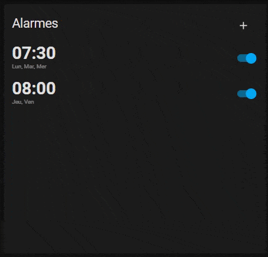

# Alarm clock Card for Home Assistant

A quick and dirty alarm clock card for Home Assistant, it is still in a wip stage and since it's for personal use a lot of shortcut were taken (don't be shocked when you see the code, I warned you). But feel free to enhance the project and PR if you wish.

## Installation

### Step 1

Clone or download this repository, copy /dist/alarm-clock-card.js to your Home Assistant config folder under /config/www/alarm-clock-card/alarm-clock-card.js

### Step 2

Add ressource to Lovelace, with for url /local/alarm-clock-card/alarm-clock-card.js and type Javascript module

### Step 3

Add an input_text to your configuration.yaml (this input will be use to retrieve your alarm settings in backend)

alarm_bedroom:
  name: Alarm bedroom
  icon: mdi:alarm

Restart HA

### Step 4

Create your card in Lovelace like this:

type: 'custom:alarm-clock-card'
entity: input_text.alarm_bedroom

### Step 5

Implement your own backend logic to do whatever you want when the time come.
Here my own implementation in node-red, if it can help : [Node Red Flow](node-red-example.json)